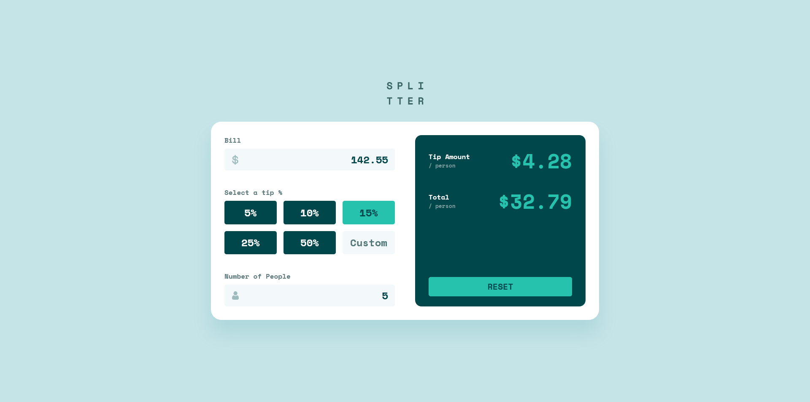

# Frontend Mentor - Tip calculator app solution

This is a solution to the [Tip calculator app challenge on Frontend Mentor](https://www.frontendmentor.io/challenges/tip-calculator-app-ugJNGbJUX). Frontend Mentor challenges help you improve your coding skills by building realistic projects.

## Table of contents

- [Overview](#overview)
  - [The challenge](#the-challenge)
  - [Screenshot](#screenshot)
  - [Links](#links)
- [My process](#my-process)
  - [Built with](#built-with)
  - [What I learned](#what-i-learned)
  - [Continued development](#continued-development)
  - [Useful resources](#useful-resources)
- [Author](#author)
- [Acknowledgments](#acknowledgments)


## Overview

This is a sample calculator app that calculates the tip and total amount per person. It has a form that requires the user to input or choose a predifined value in the case of tip percentages and those values are use to calculate the result and display it on the page. I use Sass for styling and organized it using the 7 - 1 architecture provided by Sass in their guidelines. I implemented form validation and calculation logic using JavaScript and made sure to make the code readable and easy to maintain.

### The challenge

Users should be able to:

- View the optimal layout for the app depending on their device's screen size
- See hover states for all interactive elements on the page
- Calculate the correct tip and total cost of the bill per person

### Screenshot

Empty State:


With values and result:



### Links

- Solution URL: [https://www.frontendmentor.io/solutions/responsive-tip-calculator-app-using-sass-and-javascript-JGz96Sthn8](https://www.frontendmentor.io/solutions/responsive-tip-calculator-app-using-sass-and-javascript-JGz96Sthn8)
- Live Site URL: [https://schindlerdumagat.github.io/tip-calculator-app/](https://schindlerdumagat.github.io/tip-calculator-app/)

## My process

1. Inspect the figma design to get a general idea on how to structure and style the project.
2. Write the needed HTML markup together with the needed classes.
3. Setup the Sass files (variables, layout, componets, etc) and then start writing some styles.
4. Create the JavaScript logic needed for this app (form validation and calculations, etc).
5. Test the app to check if it meets the design and functional requirements.
6. Refactor the code to increase code quality.

### Built with

- Semantic HTML5 markup
- CSS custom properties
- Flexbox
- CSS Grid
- Mobile-first workflow
- [Sass](https://sass-lang.com/) - CSS Preprocessor
- [BEM](https://getbem.com/) - Block, Element, Modifier

### What I learned

By building this project, I learned how to organize my code and make it more readable and maintainable. I used the 7 - 1 architecture as a basis to organize my Sass files. I created functions to separate the logic in my JavaScript file to make it easier to read and understand.

```scss folder structure
  sass {
    abstracts {
      _breakpoints.scss
      _index.scss
      _variables.scss
    }
    base {
      _base.scss
      _index.scss
      _reset.scss
      _typography.scss
    }
    components {
      _buttons.scss
      _calculator.scss
      _index.scss
    }
    layout {
      _calculator.scss
      _index.scss
      layout.scss
    }
    style.scss
  }
```

```js
// Updates the result box
function updateResultView(tipAmountVal, totalAmountVal) {

    tipAmount.innerText = `$${tipAmountVal}`;
    totalAmount.innerText = `$${totalAmountVal}`;
    resetBtn.removeAttribute('disabled');
}

// Calculates Tip and Total for each person 
function calculateTipAndTotal(billAmount, tipPercent, paxNumber) {

    const billShare = Number(billAmount) / Number(paxNumber);
    const tipPerPerson = billShare * (Number(tipPercent) / 100);
    const totalPerPerson = billShare + tipPerPerson;
    return {
        tipAmount: tipPerPerson.toFixed(2),
        totalAmount: totalPerPerson.toFixed(2)
    }
}
```


### Continued development

I will learn more about writing high quality code. Explore some best practices, software design and architectures.

### Useful resources

- [Sass - 7 - 1 architecture](https://sass-guidelin.es/) - This gave me an idea on how I can organize my Sass files.

## Author

- Website - [Schindler Dumagat](https://schindlerdumagat.github.io/webportfolio/)
- Frontend Mentor - [@schindlerdumagat](https://www.frontendmentor.io/profile/schindlerdumagat)
- LinkedIn - [schindler-dumagat-015238230](https://www.linkedin.com/in/schindler-dumagat-015238230/)

## Acknowledgments

- [Ethan John Paguntalan](https://www.frontendmentor.io/profile/dev-ethanjohn) - By inspecting one of his project's solution, I was able to get some idea on how to organize my Sass files to make it more maintainable. He gave me some tips on how to optimize my JavaScript code (e.g event delegation for delegating event listener to similar elements).
